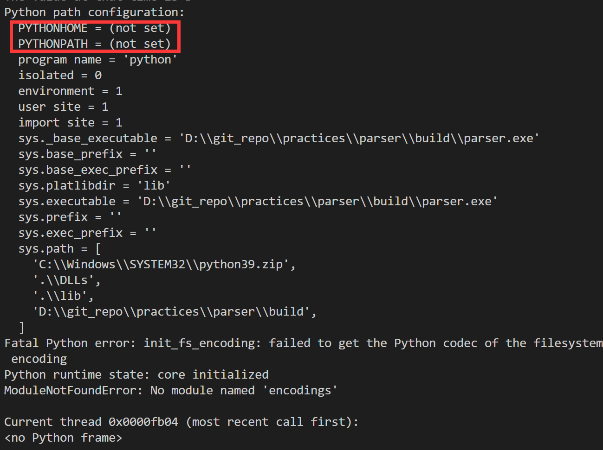
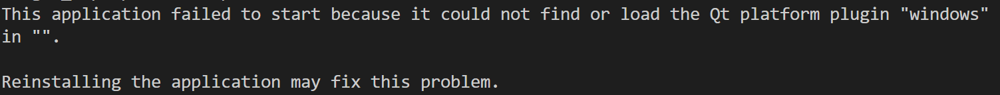
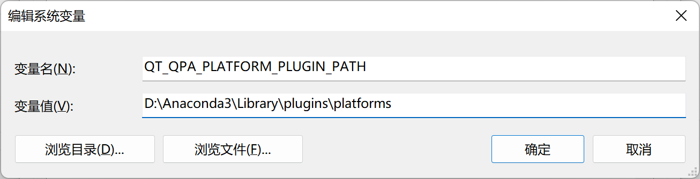

# PARSER

Parser 是一个进行电路直流分析的项目，支持含有 **电阻**、**电压源**、**电流源**、**BJT** 器件的网表识别，并且将求解工作点电压值过程以图形曲线表示。


## Install
1. 假定你的 `Python` 解释器是由 `Anaconda` 提供，如果不是，请在 [`CMakelists.txt`](https://github.com/rid-sun/practices/blob/main/parser/CMakeLists.txt) 和 [`evalUtils.h`](https://github.com/rid-sun/practices/blob/main/parser/include/evalUtils.h) 中分别按如下进行相应的修改（即将目录更换到你自己的  `Python` 解释器的安装目录）
```CMake
include_directories("D:/Anaconda3/include") # 注意，在这里键入你的python安装包的include文件夹路径
link_directories("D:/Anaconda3/libs") # 注意，在这里键入你的python安装包的include文件夹路径

```
```cpp
Py_SetPythonHome(L"D:/Anaconda3"); // 在这里向上面一样更换到你自己的Python解释器安装目录
```
2. 进行如下步骤的构建(Linux)
```bash
mkdir build
cd build
cmake ..
make
```

## Usage

```bash
parser -f inFile -d node -o outFile

node: 接地节点编号
inFile: 输入网表文件名
outFile: 输出信息文件名
```

一个例子

```bash
parser -f ../testcase/testcase4/Netlist4.txt -d 0 -o output
```

结果就是上面的 [`example`](#parser) 图示一样

## Todo

1. 需要一个处理器件送值后，如何转换单位的工具函数
2. 对于瞬态分析中的电路要求太苛刻，后续需要拓展程序适配更多电路

## Problems

1. 出现“由于找不到 ***python39.dll*** 而无法运行程序”的问题，可以在Anaconda的安装目录下找到这个 `python39.dll` 然后复制到build目录下
2. 出现如下图的提示 或者 类似的其他错误

    那么需要修改 `/include/evalUtils.h` 中 `plot` 函数的首行代码，将自己的python解释器路径填入到里面
1. 因为在 `plot.py` 中引入了 `matplotlib` 这个包，如果运行失败的话，那可能是没有install该包的原因，下载即可。具体的测试方法可以用类似`PyRun_SimpleString("import cv2")` 语句来逐条测试一下有无报错
2. 出现如下图的提示

    那么可以做如下的配置，注意配置完后重启cmd。
